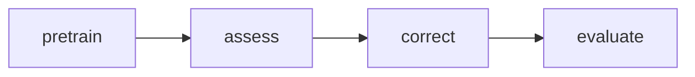

# DeepPatch

Project Code: Farfetch'd

For the technical work, please refer to the following publication.

## Publication

Zhengyuan Wei, Haipeng Wang, Imran Ashraf, and Wing-Kwong Chan. 2023. DeepPatch: Maintaining Deep Learning Model Programs to Retain Standard Accuracy with Substantial Robustness Improvement. ACM Trans. Softw. Eng. Methodol. 32, 6, Article 150 (November 2023), 49 pages. https://doi.org/10.1145/3604609

```
@article{10.1145/3604609,
author = {Wei, Zhengyuan and Wang, Haipeng and Ashraf, Imran and Chan, Wing-Kwong},
title = {DeepPatch: Maintaining Deep Learning Model Programs to Retain Standard Accuracy with Substantial Robustness Improvement},
year = {2023},
issue_date = {November 2023},
publisher = {Association for Computing Machinery},
address = {New York, NY, USA},
volume = {32},
number = {6},
issn = {1049-331X},
url = {https://doi.org/10.1145/3604609},
doi = {10.1145/3604609},
abstract = {Maintaining a deep learning (DL) model by making the model substantially more robust through retraining with plenty of adversarial examples of non-trivial perturbation strength often reduces the model’s standard accuracy. Many existing model repair or maintenance techniques sacrifice standard accuracy to produce a large gain in robustness or vice versa. This article proposes DeepPatch, a novel technique to maintain filter-intensive DL models. To the best of our knowledge, DeepPatch is the first work to address the challenge of standard accuracy retention while substantially improving the robustness of DL models with plenty of adversarial examples of non-trivial and diverse perturbation strengths. Rather than following the conventional wisdom to generalize all the components of a DL model over the union set of clean and adversarial samples, DeepPatch formulates a novel division of labor method to adaptively activate a subset of its inserted processing units to process individual samples. Its produced model can generate the original or replacement feature maps in each forward pass of the patched model, making the patched model carry an intrinsic property of behaving like the model under maintenance on demand. The overall experimental results show that DeepPatch successfully retains the standard accuracy of all pretrained models while improving the robustness accuracy substantially. However, the models produced by the peer techniques suffer from either large standard accuracy loss or small robustness improvement compared with the models under maintenance, rendering them unsuitable in general to replace the latter.},
journal = {ACM Trans. Softw. Eng. Methodol.},
month = {sep},
articleno = {150},
numpages = {49},
keywords = {accuracy recovery, maintenance, Model testing}
}
```

## Prerequisites

- Nvidia CUDA
- Python
- Pipenv

The project is maintained with [Pipenv](https://pipenv.pypa.io/en/latest/), and is highly recommended for a python project. Please refer to the link for more description and installation.

This project is tested under Ubuntu18.04, Python 3.6 and CUDA 11.

## Installation

It is easy and convenient to install all the same dependencies as the proposed with just one command.

```bash
pipenv sync
```

## How to run

The project contains four stages.



- Pretrain (optional): automatically download the model the dataset and evaluate their pretrained performance.
- Assess: prioritize the filters to be blamed
- Correct: correct the model with patching units
- Evaluate: evaluate the performance of patched model


Here, we take the resnet32 model and cifar10 dataset as an example.

The bootstrap commands are well organized with the help of pipenv.


You can list out and inspect the example commands with the below command.

```bash
~/workspace/deeppatch{main} > pipenv scripts
Command   Script
--------  ------------------------------------------------------------------------------------
pretrain  python src/eval.py    -m resnet32 -d cifar10
assess    python src/select.py  -m resnet32 -d cifar10 -f perfloss
correct   python src/correct.py -m resnet32 -d cifar10 -f perfloss -c patch --crt_type replace
evaluate  python src/switch.py  -m resent32 -d cifar10 -f perfloss -c patch --crt_type replace
```


To execute a single stage command, use `pipenv run pretrain` to bootstrap, and you may pass a flag `--help` to find and understand required and optional arguments.

```bash
~/workspace/deeppatch{main} > pipenv run assess --help
Loading .env environment variables...
usage: select.py [-h] [--data_dir DATA_DIR] [--output_dir OUTPUT_DIR]
                 [--device {cpu,cuda}] [--gpu {0,1,2,3}] [-b BATCH_SIZE] -m
                 {resnet32,mobilenetv2_x0_5,vgg13_bn,shufflenetv2_x1_0} [-r]
                 -d {cifar10,cifar100} [-n {gaussion}] [--lr LR]
                 [--momentum MOMENTUM] [--weight_decay WEIGHT_DECAY]
                 [-e MAX_EPOCH] -f {featswap,perfloss,ratioestim} -c
                 {patch,finetune} [--crt_type {crtunit,replace}]
                 [--crt_epoch CRT_EPOCH] [--susp_ratio SUSP_RATIO]
                 [--susp_side {front,rear,random}]

optional arguments:
  -h, --help            show this help message and exit
  --data_dir DATA_DIR
  --output_dir OUTPUT_DIR
  --device {cpu,cuda}
  --gpu {0,1,2,3}
  -b BATCH_SIZE, --batch_size BATCH_SIZE
  -m {resnet32,mobilenetv2_x0_5,vgg13_bn,shufflenetv2_x1_0}, --model {resnet32,mobilenetv2_x0_5,vgg13_bn,shufflenetv2_x1_0}
  -r, --resume
  -f {featswap,perfloss,ratioestim}, --fs_method {featswap,perfloss,ratioestim}
  -c {patch,finetune}, --crt_method {patch,finetune}
  --crt_type {crtunit,replace}
  --crt_epoch CRT_EPOCH
  --susp_ratio SUSP_RATIO
  --susp_side {front,rear,random}

dataset:
  -d {cifar10,cifar100}, --dataset {cifar10,cifar100}
  -n {gaussion}, --noise_type {gaussion}

optimizer:
  --lr LR               learning rate
  --momentum MOMENTUM
  --weight_decay WEIGHT_DECAY
  -e MAX_EPOCH, --max_epoch MAX_EPOCH
```

A progress bar will be shown and the results are logged under a default folder named `output`.
